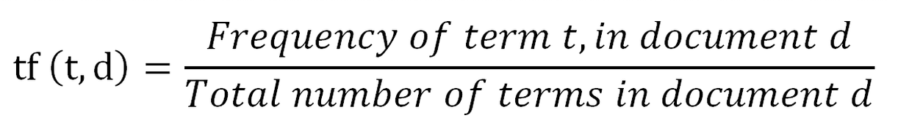
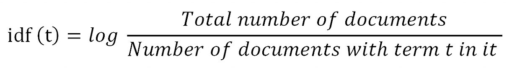
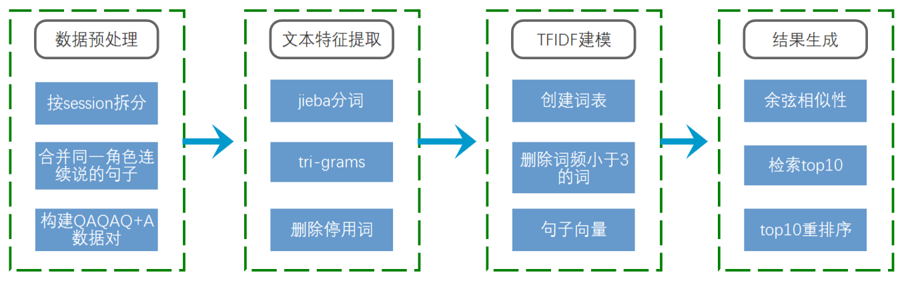
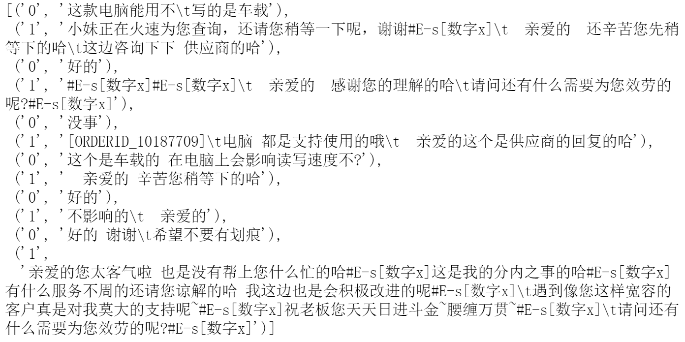

# JDDC季军（feel free）参赛方案
[JDDC](http://jddc.jd.com/)大赛，全称：JD Dialog Challenge, 全球首届任务导向型对话系统挑战赛。这个比赛从2018年4月30号开始，历经初赛、决赛、人工测评、现场答辩四个环节，在2018年10月18日正式结束，耗时4个多月。以下是我们团队的成绩单：

| 团队名称： | feel free |
|------------|-----------|
| 最终成绩： | 季军         |
| 决赛排名： | 4         |
| 决赛成绩： | 0.744771  |
| 初赛排名： | 17        |
| 初赛成绩： | 0.254222  |

初赛方案：./preliminary

决赛方案：./final

对于我们团队的解决方案，任何疑问，欢迎交流。邮箱：zeng_bin8888@163.com

## 初赛阶段思路及算法模型

初赛采用的是基于TFIDF的检索式算法。TF-IDF (Term Frequency-Inverse Document
Frequency)
表示词频和逆文档频率的乘积，代表了单词对文章的重要程度。TF-IDF是深度学习应用于NLP之前的经典表示方法。我们将TF-IDF作为检索的第一步操作，即检索出top
10 的候选集结果，再对候选集进行重新排序。

TF-IDF中TF的定义如下：

IDF的定义如下：

我们对数据进行了一些预处理，主要包括：1）删除轮次低于3的会话；2）将同一角色连续说的话合并成单句；3）将每个对话整理成Q1A1Q2A2Q3+A3的形式，删除多余轮次的对话记录。

**针对tfidf检索式方案的优化，主要有两个方面：1）文本特征提取中加入了tri-grams；2）结果生成方式改成top10重排序，重排序准则为A的长度。**

图 1：初赛解决方案

在初赛阶段，我们还尝试了多种不同的检索方案，主要有：1）BM25；2）使用word2vec创建词向量，构建句子向量后计算余弦相似性；3）LSI等。这些方案的最终得分都没能超越经过优化的tfidf基线。

## 决赛阶段思路及算法模型

决赛刚开始阶段，我们顺延初赛的思路，继续尝试了一些检索式方法，如：BM25、TFIDF等，最终发现，检索式方法效果是比较差的，测评得分徘徊在0.3。进而，我们开始采用生成式方法。生成式模型方面，我们主要尝试了两个算法，分别是seq2seq和Transformer，这两个算法都是端到端的模型。从测评的结果来看，seq2seq+attention+dropout+beam
search方案的测评得分在0.56\~0.6之间；transformer+beam
search方案得分能够超过0.7。

由于决赛中包含多轮测评，因此，一个合理的context信息引入方案是十分重要的。经过分析、讨论以及实践，我们最终的context引入方案是：“**仅使用用户上一轮次说的内容作为当前轮次的context**”。这个方案在比赛中被证实为有效，正是这个方案的引入，使得我们可以使用一个模型同时完成单轮和多轮评测。基于这个方案，数据集中的每一个历史对话都被处理成Qn-1Qn+An形式的QA对。同时，为了兼顾模型的单轮评测效果，选择了部分（约10%）历史对话仅按照Q2Q3+A3方式构造QA对，这种数据划分处理方案是确保单一模型同时完成单轮和多轮测评的关键之一。同时，在开发过程中发现数据集中部分QA对中A的长度过长，影响到模型的整体性能，因此，我们仅保留A的长度在[3,
200]范围内的QA对。

我们的最终方案是transformer+beam search。Transformer
最初被用在机器翻译上，在文章发表时取得了state-of-the-art
的翻译结果，其网络结构如下图所示：

图 2：Transformer模型架构（摘自文献3）

上图左边为Encoder模块，右边为Decoder模块。Encoder模块包括6层堆叠，每一层都具有相同的结构：Multi-Head
Attention层和Feed Forward Neural Network层，同时，使用residual connection和layer
normalization进行正则化，为了让正则计算方便，所有sub-layer的输出维度都定义为512。Decoder模块也是6层堆叠，每层除了包括Multi-Head
Attention层和Feed Forward Neural Network层外，还有一个Masked Multi-Head
Attention层，同样的使用了residual connection和layer
normalization作为正则。由于Attention无法捕捉文本顺序信息，Transformer在input
embedding和output embedding后面都加入了positional encoding。

Transformer
模型没有使用CNNs或者RNNs的序列编码方式，仅基于attention机制做编码和解码操作，提供了一个非常好的解决思路。作为Transformer的实现之一，Tensor2Tensor
(<https://github.com/tensorflow/tensor2tensor>)
工具简单易用，但是目前缺乏详细的使用文档。我们队使用了Tensor2Tensor工具包来进行模型训练。训练Transformer模型，大约使用了450万个QA对。在评测中，对beam
search的size参数进行了优化，默认为4，调整到6的时候，评测得分大约有0.01的提升。

## 模型调优心得、踩过哪些坑、对数据和任务的理解等

### 初赛

初赛任务要求每个选手根据Q1A1Q2A2Q3信息给出对应的A3，其中Q表示用户说的话，A表示客服的回复，脚标为对应的轮次。初赛提供了约11万个历史对话，每个对话中都有完整的用户与客服的对话记录。

由于初赛任务相对而言较为简单，可以认为是单轮QA，并且提供了足够多的对话历史记录。我们队经过商议，决定**采用检索式的方案，将初赛任务转换成一个从所有历史对话记录中检索与Q1A1Q2A2Q3最相似对话的问题，并选取最相似对话对应的A3作为测试答案。**

基于TFIDF检索式方案，生成结果的方式默认是直接选择最相似的对话的A3作为结果输出，这样做的问题是选择范围过于狭小。事实上，**根据我们的观察，相似性top10的对话其实都比较接近，难以评判哪一个是最相似，因此，我们认为在top10相似对话的所有A3中产生结果更为合理。**

随之而来的问题是，如何在10个候选结果中找出最好的结果，使得deltaBleu得分最高？最开始，我们采用强化学习中的DQN方法来进行选择，直接采用bleu得分作为奖励，但是并没有带来有效的提升，甚至得分下降。针对这种情况，我们分析的结论是：DQN的目标是优化长期奖励，不适用这种仅有一个回合的场景。使用强化学习的方案遇挫，我们不得不重新回到数据上寻找答案。**在逐个观察了约100个用户与客服的完整对话记录之后，我们发现，客服的回复通常倾向于比用户说的话更长，这个现象带来的启发是：在10个候选答案中选择最长的。**经测试，top10选最长的方案，大幅提升了deltaBleu评测得分，甚至一度冲上初赛排行榜第2名。

图
3：用户与客服的一个完整对话，从中可以清楚的观察到，客服的回复倾向于比用户说的话更长

初赛阶段还尝试了一些其他模型，但是最终得分都没有超越经过优化的tfidf_baseline。**由此可见，针对baseline的优化是非常有价值的。**

### 决赛

决赛任务相比于初赛要难不少，主要难点在于多轮评测的加入。由于多轮评测的加入，需要额外考虑context，否则对话难以进行。**我们认为，context的处理方式是决赛中最为关键的一步。如果不能为每一个轮次引入合适的context信息，再优秀的模型也难以给出一个令人满意的回答。**数据集方面，决赛提供的数据集与初赛类似，不过，对话记录的数量大幅增加，大约有100万个用户与客服的对话。虽然数据集类似，但无法完全照搬初赛的数据预处理方案。

决赛测评中包含150条与初赛一致的单轮测评数据，另外有15个完全的多轮评测数据。在决赛刚开始的阶段，我们队一直在考虑一个问题：150条单轮测评有没有单独采用一个模型的必要？经过再三讨论，我们得出以下结论**：只要引入的context足够好，单轮测评完全可以作为多轮的一个特例，即直接产生A3，没有单独创建模型的必要。**

在context处理方面，我们的摸索过程如下：

**首先，最容易想到的一个方案就是把当前轮次之前的所有用户和客服对话的内容作为当前轮次的context，称之为“方案A”；**这个方案看起来挺合理，但是存在的重大缺陷是，随着对话的进行，轮次不断加深，context会快速的增大，而过大的context往往意味着无效信息增多，因此直接放弃。

**接着，在“方案A”的基础上，我们想到了一个改善方案：把当前轮次之前的所有用户说的内容作为当前轮次的context，不考虑客服回复内容，称之为“方案B”；**提出这个方案，我们基于两点考量：1）客服的工作主要是解决用户的问题，因此，理解用户的问题是最关键的；2）客服之前回复用户的内容本身无法为当前轮次回复带来帮助。**依据“方案B”，我们开始实施，遇到的一个问题是：随着轮次的加深，累计的用户内容越来越多，context显得有些杂乱，模型无法找准关键词，以至于出现在第4轮对话中回复用户第3轮提出的问题的情况。**迫于无奈，“方案B”也只能放弃。

“方案B”实施过程中出现的问题是我们没有预想到的，这让我们一度感到十分被动。最后，**再一次的，我们开始逐一观察每一个对话记录，发现用户当前轮次说的内容与上一个轮次的内容往往有一定的衔接，但是与更前面的轮次之间没有太大的衔接。**因此，我们提出**“方案C”：仅采用用户上一轮次说的内容作为当前轮次的context。**实践证明，这个方案很好的解决了“方案B”中出现的问题，并且在单轮评测中也有优异的表现。

表 1：三种context引入方案

| 方案 | 描述                                                          | 采用 |
|------|---------------------------------------------------------------|------|
| A    | 将当前轮次之前的用户和客服所有对话的内容作为当前轮次的context | 否   |
| B    | 将当前轮次之前的用户说的所有内容作为当前轮次的context         | 否   |
| C    | 仅使用用户上一轮次说的内容作为当前轮次的context               | 是   |

确定了context引入方案之后，我们按照“方案C”进行了数据集的构建工作。**值的一提的是，为了提高模型对单轮评测的性能，构建数据集的时候，选择了一部分对话数据仅按照单轮评测的模式构建数据，即Q2Q3+A3。**这种处理方式在评测中被证明为有效。

决赛任务中，模型的选择方面我们主要做了以下尝试：1）seq2seq；2）transformer，3）检索式方法：BM25、TFIDF等。由于决赛数据集较大，我们根据不同的模型，对数据集进行了一定的裁剪。

由于初赛采用的是检索式方法，决赛刚开始，我们先尝试了几个检索方法，得分在0.3上下波动。同期排行榜上，采用生成式方案的队伍最高分已经超过0.6。这是一个决策上的失误，主办方一再鼓励使用生成式的方法，看来是有原因的。

说到生成式的方法，首先想到的就是seq2seq，我们采用与文献Sequence to Sequence
Learning with Neural
Networks中类似的超参进行训练，初次提交，得分就上了0.5，效果显著。针对seq2seq的调参工作大约持续了5天，但并没有带来令人兴奋的提升，反而是针对数据集的一个小改动（将用户内容分词后进行翻转），带来了较大的提升，分数上涨到0.56。由此可见，**期望通过调参大幅提升性能是不现实的。**针对seq2seq的调参经验让我意识到，**当模型的参数达到一个还不错的性能时，调整数据集也许能够带来更大的性能提升。**不过，还有一点需要明确的是，算法本身其实已经决定了性能的瓶颈在哪。

**seq2seq用于对话生成领域，其核心思想是把用户和客服说的内容作为两种“语言”，并在这两种语言之间构建一个“翻译器”。**由此，我认为机器翻译领域的其他算法也可以应用在对话生成领域。Transformer是谷歌在2017年提出的一个机器翻译算法，在WMT开放数据集的评测上实现了对seq2seq算法的超越。

seq2seq性能遇阻后，我们切换到Transformer算法。由于Transformer算法相比于seq2seq更为复杂，因此，适当的加大了QA对的数量。Transformer的参数，我们首先采用的是与文献Attention
Is All You Need中base
model一致的方案，使用的QA对数量大约是120万条，训练后，评测得分提升至0.61，效果不错。然后，我们使用更多的QA对（约450万条），并采用与文献Attention
Is All You Need中big
model一致的Transformer参数和超参进行训练，评测得分提升至0.69。最后，**我们逐一评测Transformer模型最近20个checkpoints的线下评测得分，选取得分最高的5个checkpoints所对应的模型进行average操作，得分提升至0.73，调整beam
size参数后，得分提升至0.74。**

总结
----

总结一下此次参赛的经验教训，大致有这么几点：

1）重视baseline及其优化，而不是盲目的尝试各种模型；

2）引入多轮对话中的context信息应该尽可能简单，而不是复杂，复杂往往意味着无效；

3）调参是个无底洞，当性能达到一个还不错的状态时，期望通过调参来继续提升性能是不现实的；

4）针对数据集的一些调整，也许会有意想不到的性能提升；

5）机器翻译的一些算法迁移到对话系统领域也会有不错的结果；

6）选取几个效果最好的checkpoint进行average，也是提高模型性能的一个有效思路。

说说自己对多轮对话的认识和未来的发展趋势
========================================

对于任务导向型多轮对话而言，目前学术界的研究集中在End-to-End模型上，基于Seq2Seq框架，大家都在不断提出fancy的新模型解决对话状态管理，数据库查询操作和回复生成等问题。然而End-to-End模型也具有不可控的缺点，因此对于工业界而言，传统
Pipeline 形式 (NLU-DM-NLG) 的多轮对话是非常常用的解决方案。

目前NLP的研究还没有真正理解语意，因此知识图谱的加持将会对NLP的研究起到非常大的作用。人们在对话时，脑子里有知识的存在来支持。因此，除了实用的模型外，知识的融入同样对多轮对话的发展起积极作用。比如：利用知识图谱在推理上的优势用于辅助理解问题，辅助问答，基于NER和关系将实体正确地链接到知识库，图谱知识表示为知识路径，构造答案候选集，将问答任务转化成与路径的匹配程度计算等。

多轮对话的难点在于一句话中很难包含答案的所有限定条件、指代、以及省略，且存在场景切换、跨场景继承等挑战，多轮对话通常是有问有答，在用户提问内容不够清晰的时候，机器也可以主动向用户询问，并且会根据上下文来判断该给出什么样的答案或提出什么样的问题。未来，多轮对话会应用在获取信息的各种渠道，对话模型需要有能力从与人的交互中主动学习。

随着物联网和智能家居的发展，对话系统未来的发展前景可期。在亲身体验过各类智能音箱产品之后，我对语音作为系统操作的形式是比较认可的，也感受到了这种操作方式的便利。**由于
“人性是懒惰的”，当一种更为便利的操作方式出现，并逐渐走向成熟之后，必然会成为一种趋势，这个现象在二维码领域得到证实。**作为语音操作的底层，对话系统的应用也会越来越广泛。

## 主要参考资料

1.  <http://www.wildml.com/2016/07/deep-learning-for-chatbots-2-retrieval-based-model-tensorflow/>

2.  GALLEY M, BROCKETT C, SORDONI A等. deltaBLEU: A Discriminative Metric for
    Generation Tasks with Intrinsically Diverse Targets[J]. arXiv:1506.06863
    [cs], 2015.

3.  VASWANI A, SHAZEER N, PARMAR N等. Attention Is All You Need[J].
    arXiv:1706.03762 [cs], 2017.

4.  VASWANI A, BENGIO S, BREVDO E等. Tensor2Tensor for Neural Machine
    Translation[J]. arXiv:1803.07416 [cs, stat], 2018.

5.  BORDES A, BOUREAU Y-L, WESTON J. Learning End-to-End Goal-Oriented
    Dialog[J]. arXiv:1605.07683 [cs], 2016.

6.  <https://github.com/IBM/pytorch-seq2seq>

7.  <https://github.com/tensorflow/tensor2tensor>

8.  SUTSKEVER I, VINYALS O, LE Q V. Sequence to Sequence Learning with Neural
    Networks[J]. arXiv:1409.3215 [cs], 2014.

9.  QIU M, LI F-L, WANG S等. AliMe Chat: A Sequence to Sequence and Rerank based
    Chatbot Engine[C]//Proceedings of the 55th Annual Meeting of the Association
    for Computational Linguistics (Volume 2: Short Papers). Vancouver, Canada:
    Association for Computational Linguistics, 2017: 498–503.
